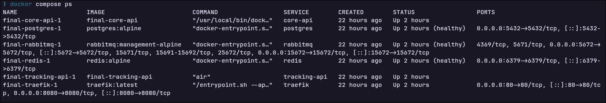
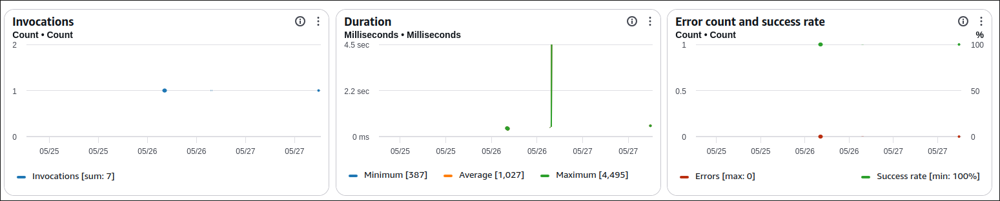
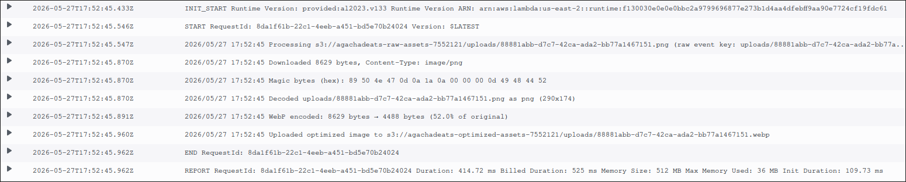
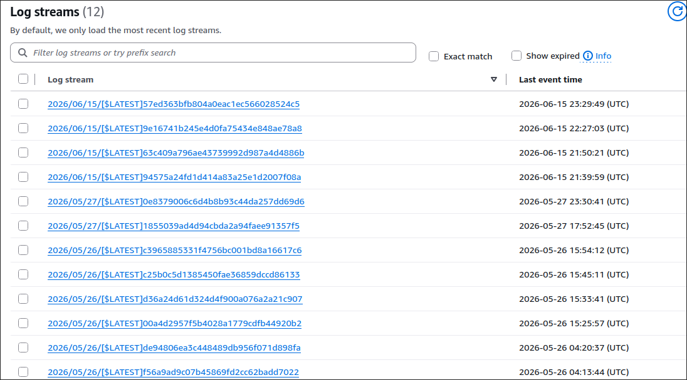
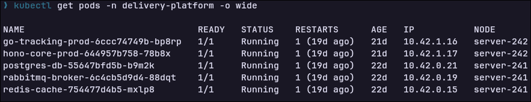
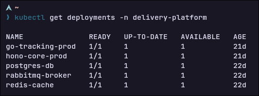
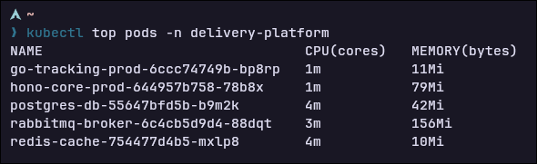

# Informe de Avance de Proyecto Final

**Asignatura:** Trabajando en la Nube (COM610)

**Semestre:** 1/2026

**Estudiante:** Andrés Alejandro Torres González

**Docente:** Ing. Marcelo Quispe Ortega

**Repositorio GitHub:** [https://github.com/andrestorresgo/COM610-project.git](https://github.com/andrestorresgo/COM610-project.git)

---

## 1. Tabla de Infraestructura y Servicios

La siguiente tabla detalla los componentes de la arquitectura híbrida distribuidos entre el entorno local de desarrollo/orquestación y los servicios en la nube pública de AWS:

| Componente / Servicio | Rol | Tecnología | IP / Puerto / Endpoint | Estado Actual |
| :--- | :--- | :--- | :--- | :--- |
| **Core API** | Transacciones transaccionales, órdenes y lógica de negocio central. | Hono (Bun Runtime) | `api.localhost` / Puerto `3000` | **Operativo** |
| **Tracking API** | Gestión de WebSockets de alta frecuencia y coordenadas GPS de couriers. | Go (Golang) | `tracking.localhost` / Puerto `8080` | **En Configuración** |
| **PostgreSQL** | Base de datos relacional para usuarios, tiendas, órdenes y finanzas. | PostgreSQL 16 + Drizzle ORM | `localhost:5432` (Interno K3s) | **Operativo** |
| **Redis Cache** | Almacenamiento efímero de coordenadas GPS y estados de sesión. | Redis Alpine | `localhost:6379` | **Operativo** |
| **Event Bus** | Broker de mensajería asíncrona para comunicación entre microservicios. | RabbitMQ (Management) | `localhost:5672` / `15672` | **Operativo** |
| **Edge Router** | API Gateway, enrutamiento basado en Hosts y balanceo de carga. | Traefik | `localhost:80` / `localhost:8080` | **Operativo** |
| **Object Storage** | Almacenamiento de imágenes de productos de manera directa (Pre-signed). | AWS S3 Bucket | Enlace dinámico s3.amazonaws.com | **Operativo** |
| **Image Optimizer** | Compresión serverless de imágenes activada por eventos de S3. | AWS Lambda (Node.js) | Trigger S3 nativo | **Operativo** |
| **K3s Master** | Nodo de control plano y hospedaje de infraestructura de datos. | K3s (VM 1 - ~6GB RAM) | IP Asignada por la Universidad | **En Configuración** |
| **K3s Worker** | Nodo de cómputo elástico para APIs y escalabilidad de Pods. | K3s (VM 2 - 4 Cores) | IP Asignada por la Universidad | **En Configuración** |

---

## 2. Bitácora de Avance

| Fecha | Actividad | Responsable | Dificultad Superada |
| :--- | :--- | :--- | :--- |
| **05/05/2026** | Contenerización, configuración de proxy inverso Traefik y comunicación  inicial. | Andrés Alejandro Torres González | Se presentaba un error de resolución de nombres de red al comunicar el contenedor de Go con el de Bun. Se solucionó agregando labels especializados para que traefik pueda descubrir los servicios dentro de la red (`delivery-network`) y mapear correctamente los alias de los contenedores. |
| **21/05/2026** | Integración del bus de eventos asíncronos con RabbitMQ y sincronización en tiempo real vía WebSockets. | Andrés Alejandro Torres González | La Tracking API en Go perdía la conexión si RabbitMQ no terminaba de inicializarse primero. Se superó implementando una función de reintento exponencial (*exponential backoff*) en Go para asegurar una reconexión resiliente tras caídas del contenedor. |
| **26/05/2026** | Implementación del puente híbrido con AWS (S3 Pre-signed URLs, Lambda function). | Andrés Alejandro Torres González | La función Lambda fallaba al intentar decodificar el archivo. Se identificó que el problema ocurría al enviar la imagen en un request con formato multipart/form-data. Se solucionó cambiando la forma de envío de la imágen. |
| **10/06/2026** | Conexión y corrección del Webhook local de la API con AWS Lambda para carga automática de URLs de imágenes optimizadas. | Andrés Alejandro Torres González | 1. La Lambda en AWS no tenía configurada la variable `WEBHOOK_URL`. Se solucionó exponiendo el puerto 3000 del Core API local en docker-compose y estableciendo un túnel público mediante localtunnel, actualizando la Lambda para apuntar a esta URL.<br>2. Hono API fallaba con error 401 debido a que la firma HMAC fallaba al leer el cuerpo del request. Esto ocurría porque el stream del cuerpo ya había sido consumido por el middleware de validación de Zod/OpenAPI. Se implementó un middleware específico para el endpoint de webhook que intercepta y clona el stream del cuerpo original en el Hono Context antes de que sea procesado por la validación. |

---

## 3. Comandos Principales Utilizados en el Avance

### Sección A: Infraestructura Base y Contenedores

Comandos para levantar el ecosistema completo localmente, verificar la salud de las redes y validar que los servicios estén listos para interactuar:

```bash
# Levantar todos los servicios locales en segundo plano usando multi-stage builds (target: dev)
docker compose up -d --build

# Verificar el estado operativo y puertos expuestos de todos los contenedores
docker compose ps

# Listar las redes activas para corroborar el aislamiento de la infraestructura
docker network ls

# Validar la conectividad cruzada e interna desde el Core API hacia el broker de RabbitMQ
docker compose exec core-api curl -v http://rabbitmq:15672

```

### Sección B: Infraestructura Híbrida Levantada

#### Sección B1: Compilación de Producción y Push a Container Registry

```bash
# Logearse a docker hub
docker login

# Compilar API Hono
docker build \
  --target prod \
  -t andrestorresgo/agachadeats-core-api:latest \
  -f ./apps/orders-api/Dockerfile ./apps/orders-api

# Compilar servicio de tracking
docker build \
  --target prod \
  -t andrestorresgo/agachadeats-tracking-api:latest \
  -f ./apps/tracking-api/Dockerfile ./apps/tracking-api

# Verificar imágenes
docker images | grep agachadeats-core-api

# Publicar imágenes a docker hub
docker push andrestorresgo/agachadeats-core-api:latest
docker push andrestorresgo/agachadeats-tracking-api:latest
```

#### Sección B2: Deploy en Cluster K3S

```bash
# Desplegar workloads 
kubectl apply -f 10-apps-production.yaml

# Verificar que los pods transicionen de ContainerCreating a
kubectl get pods -n delivery-platform -w

# Verificar inicio de las apps y handshakes con la BD
kubectl logs -n delivery-platform deployment/hono-core-prod
kubectl logs -n delivery-platform deployment/go-tracking-prod
```

### Sección C: Seguridad, Variables de Entorno y Firewalls

Comandos ejecutados para auditar que ninguna credencial crítica esté expuesta públicamente en el sistema de control de versiones y validar las políticas del cortafuegos:

```bash
# Verificar que el archivo .env se encuentre correctamente ignorado por Git
cat .gitignore | grep .env

# Buscar de forma recursiva palabras clave en el código fuente para garantizar que no existan contraseñas quemadas
grep -r "password" ./src || echo "No se encontraron credenciales explícitas en texto plano."

# Comprobar el estado del firewall del sistema operativo para asegurar políticas de puertos restrictivas
sudo ufw status verbose

```

### Sección D: Conectividad de Webhooks y Pruebas Locales

Comandos utilizados para exponer el entorno de desarrollo local, enlazar el webhook con AWS Lambda y verificar la actualización automática de la base de datos:

```bash
# Exponer el puerto local de Core API (3000) a la red pública mediante un túnel
npx -y localtunnel --port 3000

# Actualizar las variables de entorno de la AWS Lambda para definir el WEBHOOK_URL dinámico del túnel
aws lambda update-function-configuration \
  --function-name image-optimizer \
  --environment "Variables={WEBHOOK_URL=https://<subdominio-tunnel>.loca.lt/images/webhook,WEBHOOK_SECRET=5cb77cce1bb90a49df4d916babe1a09c5bc5c9abb93c4b0203f86ea6c66900bb,DEST_BUCKET=agachadeats-optimized-assets-7552121}" \
  --region us-east-2

# Consultar los logs de CloudWatch para auditar la ejecución de la Lambda y llamadas HTTP de Webhook
aws logs get-log-events \
  --log-group-name /aws/lambda/image-optimizer \
  --log-stream-name '2026/06/10/[$LATEST]94575a24fd1d414a83a25e1d2007f08a' \
  --region us-east-2

# Validar en la base de datos local que la imagen del restaurante fue actualizada con el path optimizado (.webp)
docker exec -i final-postgres-1 psql -U agachadeats -d agachadeats_db -c "select id, name, image_url from restaurants;"
```

---

## 4. Evidencias de Servicios Funcionando

* **Evidencia 1 (Consola - Contenedores Activos):** Al ejecutar `docker compose ps`, se observan los contenedores `core-api`, `tracking-api`, `postgres-db`, `redis-cache`, `rabbitmq-bus` y `traefik-gateway` en estado `Up`.


* **Evidencia 2 (Consola de AWS - S3 y Lambda):** Panel de AWS reflejando las ejecuciones exitosas de la función Lambda encargada de la optimización y compresión multimedia.



* **Evidencia 3 (Consola de AWS - CloudWatch Logs):** Logs de CloudWatch mostrando la ejecución exitosa de la función Lambda, incluyendo la decodificación correcta del body del webhook y la actualización exitosa del objeto en S3.


* **Evidencia 4 (Pods en K3s):** Pods corriendo exitosamente en el cluster K3s, reflejando la arquitectura híbrida distribuida.


* **Evidencia 5 (Logs de deployments en K3s):** Logs de K3s mostrando la ejecución exitosa de los pods de Core API y Tracking API.


* **Evidencia 6 (Logs uso de recursos en K3s):** Logs de K3s mostrando el uso de recursos de los pods de Core API y Tracking API.

